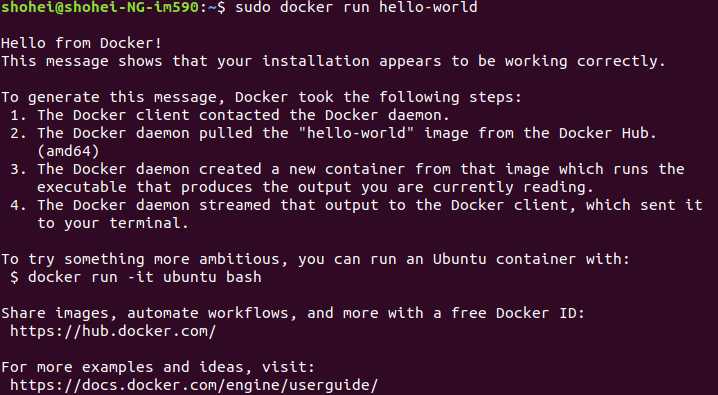
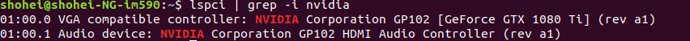

## install docker
#### requirement
Ubuntu 18.04(LTS)


### Uninstall old versions
```bash
sudo apt-get remove docker docker-engine docker.io containerd runc
```

### Update repository
1. Update `apt`.  
```bash
sudo apt-get update
```

2. Install packages
```bash
sudo apt-get install \
    apt-transport-https \
    ca-certificates \
    curl \
    gnupg-agent \
    software-properties-common
```

3. Add Docker's GPG key  
```bash
curl -fsSL https://download.docker.com/linux/ubuntu/gpg | sudo apt-key add -
```
return OK

4. Add repository
```bash
sudo add-apt-repository \
   "deb [arch=amd64] https://download.docker.com/linux/ubuntu \
   $(lsb_release -cs) \
   stable"
```
5. update `apt` again  
```bash
sudo apt-get update
```

### Install docker
1. update `apt` package
```bash
sudp apt update
```
2. Install Docker
```bash
sudo apt-get install docker-ce docker-ce-cli containerd.io
```

3. Check Install
```bash
docker --version
```

4. Run container
```bash
sudo docker run hello-world
```


#### 参考
[公式サイト](https://docs.docker.com/install/linux/docker-ce/ubuntu/#install-using-the-repository)   
[その他](https://qiita.com/iganari/items/fe4889943f22fd63692a)

---
## DockerでGPUを使うために
やること
* 最新のNVIDIAドライバーをインストール
* Dockerの最新ver (19.03) をインストール
* nvidia-container-toolkit　パッケージをインストール


* OS version  
```bash
lsb_release -a
```
* GPU  
```bash
lspci | grep -i nvidia
```


- GeForce GTX 1080 Ti

### Nvidia container toolkit
[Quickstart](https://github.com/NVIDIA/nvidia-docker/tree/master#quickstart)に  
NVIDIA driver とDocker 19.03が必要  
CUDA toolkitは必要ないが *driver* は必要  
との記述

#### Install cuda-drivers
[official cite](https://developer.nvidia.com/cuda-downloads?target_os=Linux&target_arch=x86_64&target_distro=Ubuntu&target_version=1804&target_type=deblocal)
から自分のMachineのスペックを選択  
Installer Typeをdeb(local)にする  
表示されるコマンドのinstall cuda 以外を実行
```bash
wget --no-check-certificate https://developer.download.nvidia.com/compute/cuda/repos/ubuntu1804/x86_64/cuda-ubuntu1804.pin

sudo mv cuda-ubuntu1804.pin /etc/apt/preferences.d/cuda-repository-pin-600  

wget http://developer.download.nvidia.com/compute/cuda/10.2/Prod/local_installers/cuda-repo-ubuntu1804-10-2-local-10.2.89-440.33.01_1.0-1_amd64.deb  

sudo dpkg -i cuda-repo-ubuntu1804-10-2-local-10.2.89-440.33.01_1.0-1_amd64.deb  

sudo apt-key add /var/cuda-repo-10-2-local-10.2.89-440.33.01/7fa2af80.pub  

sudo apt-get update
```
ドライバーのみインストール
```
sudo apt-get -y install cuda-drivers
```

### Install nvidia-container-toolkit package
```bash
distribution=$(. /etc/os-release;echo $ID$VERSION_ID)
curl -s -L https://nvidia.github.io/nvidia-docker/gpgkey | sudo apt-key add -
curl -s -L https://nvidia.github.io/nvidia-docker/$distribution/nvidia-docker.list | sudo tee /etc/apt/sources.list.d/nvidia-docker.list

sudo apt-get update && sudo apt-get install -y nvidia-container-toolkit
sudo systemctl restart docker
```
ここで再起動
```bash
sudo reboot
```
確認
```bash
nvidia-container-cli info
```
runしてみる
```bash
docker run --gpus all nvidia/cuda:9.0-base nvidia-smi
```


## Docker コマンドリスト

* DockerのコンテナからホストPCのディレクトリを見れるようにする  
名前は違うけど同じ場所を指している状態になる。  
docker run するときにやらないとだめ.container作ってからはできない。  

```bash
docker run -v [自分のDir]:[コンテナ側のDir] ...
```

#### 参考
[nvidiaの人のqiita記事](https://qiita.com/ksasaki/items/b20a785e1a0f610efa08)  
[official Quickstart](https://github.com/NVIDIA/nvidia-docker/tree/master#quickstart)
